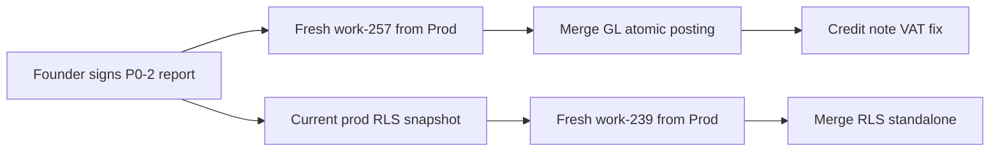

# P0-3 — work-257 / work-239 Landing Assessment

**Story:** SCRUM-34  
**Handover reference:** §4.1 (Open branches)  
**Audited:** 2026-08-23  
**Base branch:** `Prod` @ `fb98ccb`

---

## Summary

| Branch (handover name) | Remote equivalent | Recommendation |
|------------------------|-------------------|----------------|
| `work-257` (#257) | `origin/devin/gl-single-invoice` | **Cherry-pick / rework onto fresh branch from `Prod`** — do not merge wholesale |
| `work-239` (#239) | `origin/devin/rls-remediation` | **Re-verify against current prod snapshot, then rework onto fresh branch** — do not merge wholesale |

Neither branch exists under the handover naming convention. Both are **behind current `Prod`** (missing parent portal v2 commits at `fb98ccb`).

---

## work-257 → `origin/devin/gl-single-invoice`

### What it contains

- Migration `shared/database/migrations/20260811_01_gl_invoice_posting.sql` — `create_invoice_with_journal` Postgres function
- Chart-of-accounts seeding in same migration chain
- Billing route wired to atomic RPC
- Extended `billing.test.ts` coverage (18 tests claimed passing on branch)

### Critical sequencing (handover §4.1)

> If `create_invoice_with_journal` ships before CoA seeding, every invoice creation returns 422.

The branch keeps seeding and function together — **preserve this invariant** on any rebase/cherry-pick.

Confirmed: `chart_of_accounts` filters on `is_active = TRUE`, not `status`.

### Merge readiness

| Check | Status |
|-------|--------|
| Typecheck passes | ✅ (per handover; re-run on fresh branch) |
| billing.test.ts 18/18 | ✅ on branch; ✅ on `Prod` (mock skips journal) |
| Includes current `Prod` commits | ❌ — 2 commits behind |
| ZATCA chain row lock in transaction | ⚠️ — verify on branch before merge |
| Credit note VAT reversal | ❌ — separate issue; not in branch scope |
| `post_journal` raises on NULL | ⚠️ — may still return NULL on branch; verify |

### Recommendation

1. Create fresh branch `work-257` from current `Prod`.
2. Cherry-pick migration + billing changes from `devin/gl-single-invoice`.
3. Resolve conflicts with parent portal v2 billing paths.
4. Add ZATCA chain row lock if absent.
5. Change `post_journal` to raise (ADR-002) in same PR or immediately after.
6. Run billing tests + manual invoice creation on demo tenant with CoA seeded.
7. **Do not merge** until founder reviews reconciliation report sign-off.

---

## work-239 → `origin/devin/rls-remediation`

### What it contains

- Bulk RLS policy remediation across ~52 tables
- Rollback script at `shared/database/rollbacks/20260810_rls_rollback.sql`
- Policies targeting canonical claim: `auth.jwt() -> 'app_metadata' ->> 'tenant_id'`

### Merge readiness

| Check | Status |
|-------|--------|
| Tested against current prod snapshot | ❌ — branch predates #237, #238, #254 merges |
| Applies alone (one concern per PR) | ✅ — must remain standalone |
| Rollback script tested | ⚠️ — must re-test on dev snapshot |
| All 52 tables covered | ⚠️ — re-enumerate against live policy list |
| Legacy `request.jwt.claims` patterns on `Prod` | ❌ — 10 migration files still use non-canonical pattern |

### Recommendation

1. Export current production RLS policy inventory (founder read-only access or SQL editor).
2. Diff against `devin/rls-remediation` branch policies.
3. Create fresh branch `work-239` from `Prod`.
4. Port only policies still defective; do not replay entire branch blindly.
5. Test rollback on dev snapshot **before** any staging apply.
6. Run tenant A/B isolation matrix post-apply.
7. **Never bundle** with #257 or any other concern.

---

## Combined sequencing

**Do not parallel-merge** #257 and #239 — separate PRs, separate rollback plans, separate verification.

---

## Founder actions required

1. Approve cherry-pick strategy (vs full branch merge).
2. Provide prod read-only snapshot for RLS re-verification.
3. Confirm demo tenant invoice creation still works after #257 lands on dev.
